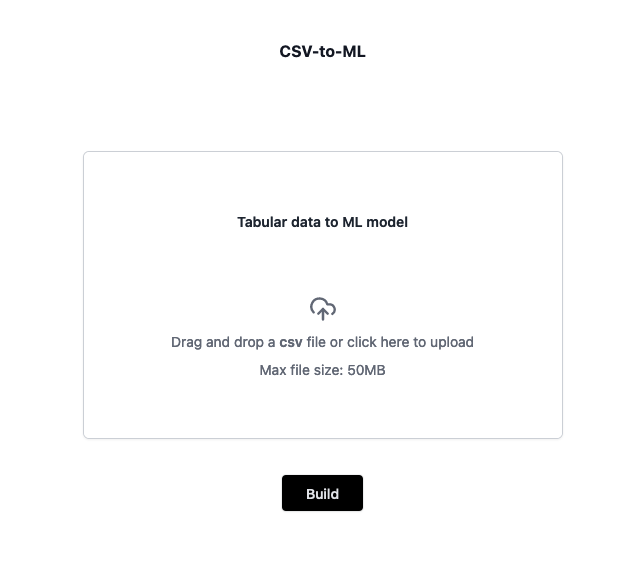

# 🧌 csv-to-ml

Upload a CSV file and get an ML model

<p align="center"></p>

## Setup

1. Get an OpenAI API Key
2. Create an assistant and copy its id

   2.1 Name: `csvtoml`

   2.2 Instructions:

   > "Create a ML model based on csv I provided to predict data. Please do data preprocessing and cleaning, feature engineering and all possible improvements that will contribute to better model's quality and then repeat your experiments using the new, cleared data. Shuffle train/test data split, make it 70% train, 20% test and 10% validation and repeat experiments using cleared data. Save the weights and biases in a Pickle format that makes it super easy to just load them on my computer and run inference on this model. Return the Pickle file so I can download it. In a single separate file, return all the source code of your machine learning model architecture, which allows to just take the Pickle file you provided and start doing inference without any further changes. Don't ask any additional questions, just go straight to training the model, returning the valid Pickle file with weights and biases and fully correct Python file with source code of our machine learning model, which allows to load a pickle file and do the predictions right away. If you get a csv file as an input, it probably contains either tabular data or timeseries data. Make sure to choose simple yet most accurate and powerful model for this purpose. If accuracy is less than 50%, then pick another model architecture and reevaluate. Calculate final accuracy and loss on validation set and put it as JSON to file metrics.json. This is very important: as an final output, you must return ONLY three files: "parameters.pkl", which is a Pickle file with weights and biases, "model.py", which contains source code of our model and "metrics.json" which contains final accuracy as "accuracy" property and loss as "loss" property for the trained model. In Python file, make sure you add code that allows to just run the file using python model.py - so the code needs if **name** == "**main**" and then relevant call for prediction."

   2.3 Model: `gpt-4-turbo-preview`

   2.4 Tools: `Code Interpreter`

Create `.env` file and fill it with values:

```
OPENAI_API_KEY=
OPENAI_ASSISTANT_ID=
```

## Build

```sh
npm install
npm run build
```

## Run dev

```
npm run dev
```

## Run prod

```
npm run start
```

## License

GPLv3

## Author

UI comes from [Vercel templates](https://vercel.com/templates)

Jędrzej Paweł Maczan, Poland, 2024
